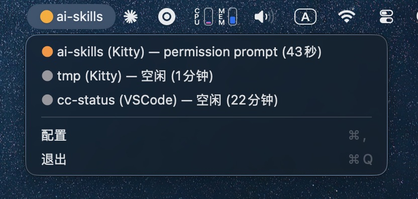

# CC Status

> 原生 macOS 菜单栏应用，实时监控所有 Claude Code 会话的运行状态。无需打开终端，也无需切换窗口——看一眼菜单栏，就知道哪个 session 在等你回复。



## 它能做什么

- **一眼看到全局状态** —— 菜单栏圆点按"最坏情况"变色：等待 > 运行 > 空闲 > 未检测。
- **列出所有活跃 session** —— 下拉菜单里每个 session 一行，显示项目名、宿主 app、状态、已运行时长。
- **点击直达宿主 app** —— 自动识别 session 跑在哪个终端/编辑器，点一下就能切过去继续工作。
- **项目名直贴菜单栏** —— 等待中、运行中、空闲三种状态各自可选是否显示项目名，直接贴在图标后面，不用展开菜单。
- **工作状态会呼吸** —— 绿色图标会有节奏地脉动，肉眼也能感知"还在跑"。
- **零延迟响应** —— 基于文件监听（FSEventStream），session 状态一变化菜单栏立刻刷新。
- **睡眠/唤醒自愈** —— 系统睡眠再唤醒后无需重启，状态自动恢复准确。
- **桌面通知** —— 有 session 需要输入时弹出通知，点击通知直接跳转到对应窗口。
- **配置面板** —— 通知开关、三种状态的菜单栏名称显示（带状态色图标）、名称截断长度、列表排序，一目了然。

## 状态指示

| 图标 | 含义 | 触发条件 |
|------|------|----------|
| 🟠 实心 | 有 session 等待输入 | 任意 session 处于 `blocked` / `waiting`（如 permission prompt） |
| 🟢 实心（呼吸） | 有 session 工作中 | 任意 session 处于 `working` / `busy` |
| ⚪ 实心 | 全部空闲 | 所有 session 都是 `idle` |
| ○ 空心 | 未检测到 Claude Code | 没装 CLI，或所有 session 进程已退出 |

**优先级规则**：取所有活跃 session 中"最严重"的状态作为菜单栏指示色，等待永远压过运行。

下拉菜单里每行还会附一个颜色点，规则同上——一眼扫过去就能挑出需要处理的 session。

## 构建 & 运行

```bash
# 开发构建
swift build

# 直接运行
swift run

# 打包为 .app bundle（ad-hoc 签名，支持桌面通知）
./scripts/build-app.sh
open CCStatus.app

# 多架构 release 构建（arm64 + x86_64）
./scripts/build-release.sh

# release 构建 + DMG 打包
./scripts/build-release.sh --dmg
```

## 系统要求

- macOS 13 (Ventura) 及以上
- Xcode Command Line Tools（提供 `swift` 和 `clang`）
- [Claude Code CLI](https://docs.claude.com/claude-code) 已安装
- 桌面通知功能需要以 .app bundle 方式运行（`swift run` 不支持通知）
- 首次启动可能需要在「系统设置 → 隐私与安全性 → 辅助功能」中授权，用于切换宿主 app

## 许可

本项目以 MIT 协议开源。
